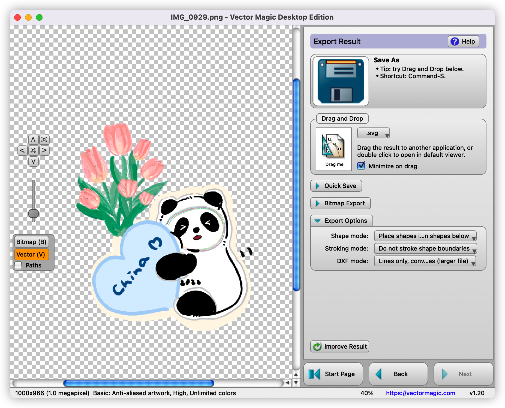
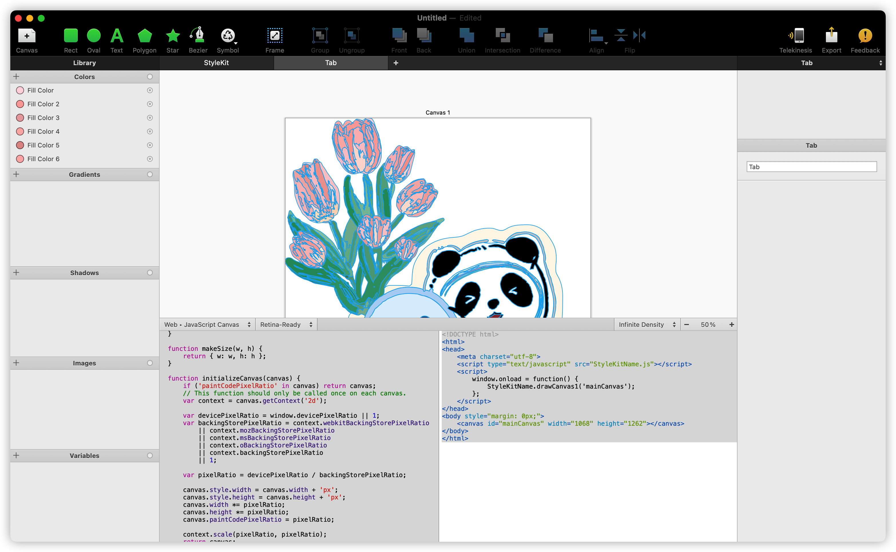
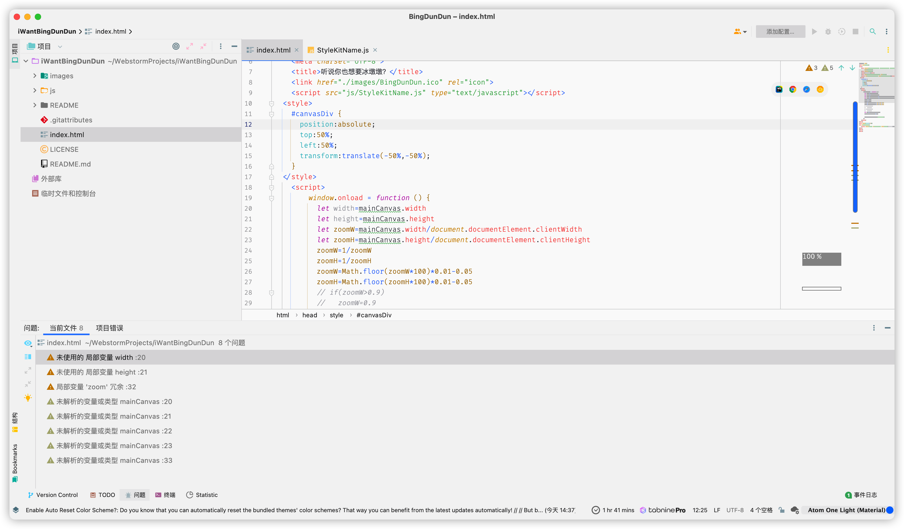
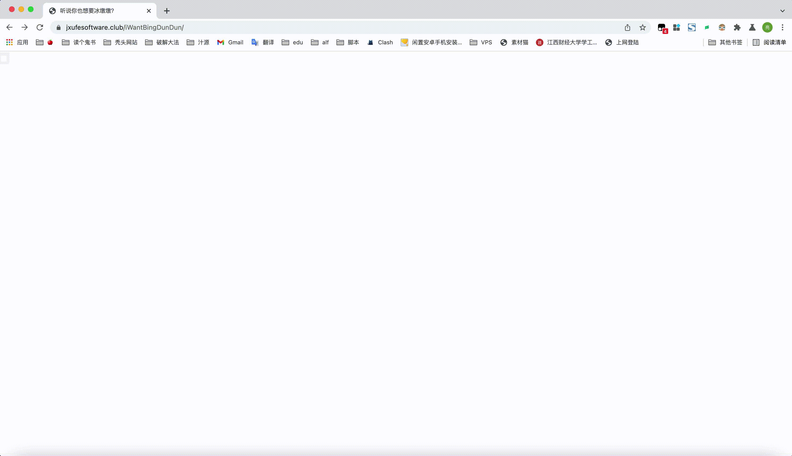

# iWantBingDunDun
 听说你也想要个冰墩墩？

那就直接用代码造一个！

## 效果预览

https://www.jxufesoftware.club/iWantBingDunDun/

## 如何实现的代码？

1. 首先你需要一张冰墩墩的美图

   

2. 删除多余部分，仅留下你想要绘出的部分

   

3. 将你的图转换识别为矢量图SVG，我采用的是[Vector Magic](https://zh.vectormagic.com/)

   

   

4. 将矢量图识别为程序代码，我采用的是[PaintCode3](https://www.paintcodeapp.com/)，转化为HTML canvas代码

   

5. 复制生成的html和JavaScript代码到文件中，改造JavaScript代码，使之适应移动端，并一步一步画出图案，更真实

   

6. 使用[image2Icon](https://img2icnsapp.com)制作网站图标

    [BingDunDun.ico](images/BingDunDun.ico) 

7. 大功告成，上线网站，让更多人拥有冰墩墩！

   

## 特别鸣谢

感谢[MacWk](https://www.macwk.com/)在软件上给予的支持

感谢微博 周游水星 提供的手绘可爱冰墩墩图
